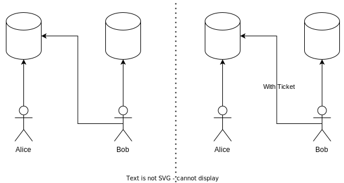
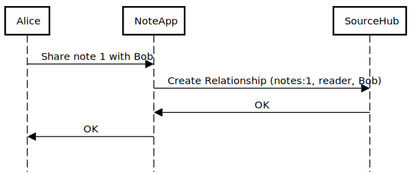
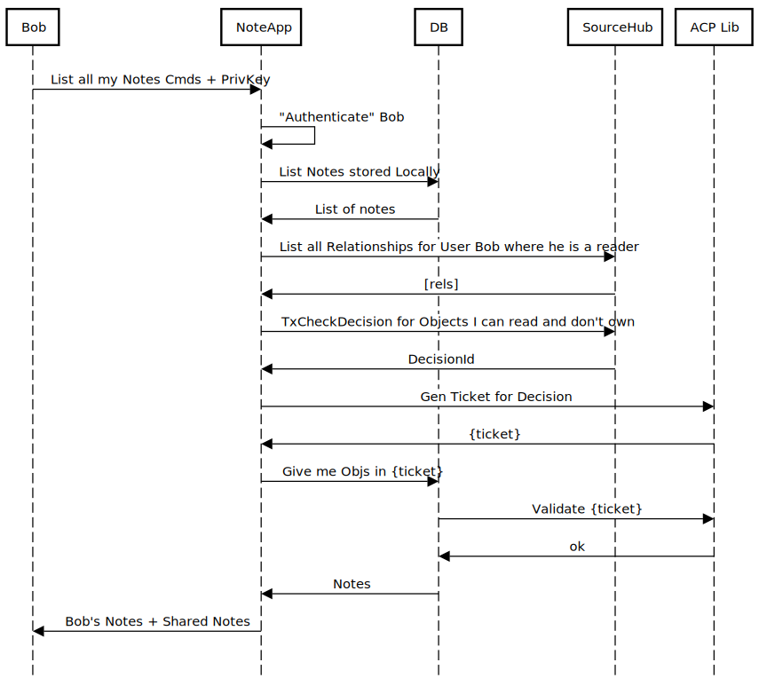

# NoteApp

NoteApp was written as a demo of SourceHub's Access Control model and how it can be used to build collaborative applications.

## ACP System

At its core, the scenario Source's Access Control system supports is the following:

Alice and Bob have their private data.
Alice decides to share some data with Bob.
Bob then has to prove he is authorized to access the data Alice shared.

In order to meet these requirements the ACP system must:
- Enable developers to establish a set of rule expressing the conditions under which sharing is allowed (policy).
- Provide a mechanism to grant access to some resource (relationships)
- Provide a mechanism for Bob to demonstrate his authority to access the data that Alice shared (tickets).

## App Collaboration

This app makes use a simple Domain Model to showcase the ACP system.

The App's only entity is a Note, owned by some User.

The app has 4 operations:
- Create a Note
- List all Notes
- Share a Note
- Unshare a Note.

Notes are always accessible to its creator.
Users can share notes with different users, which means the note will show up when they list them.

Each of operation interacts with the ACP system in a certain way.

### Create Note

To Create a Note the App must store it locally in its DB and register the new Object in SourceHub

## Share Note

To share a Note, the App creates a Relationship in SourceHub specifying the Note through its ID and the Actor that should be given Access.

### List Notes

To List an User's Notes, the App can fetch all local Notes and then figure out which Notes have been shared with the local user.

Through the Relationships stored in SourceHub, it's possible to list all Notes an user has access to.
From this list of Nodes, the App must generate a Ticket proving that the User has Access to those Notes.
Finally, the App uses this ticket to request the shared Notes from the DB.

